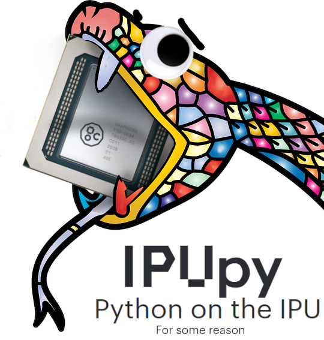
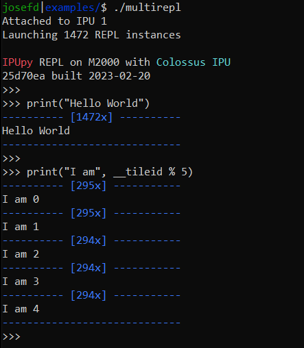
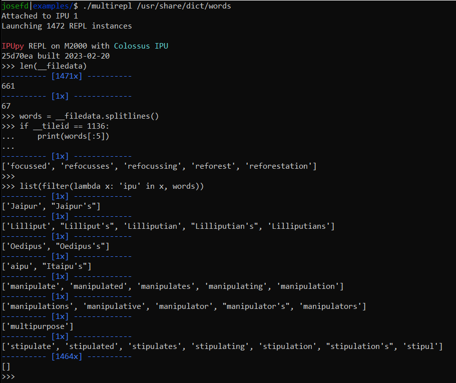
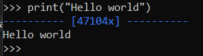
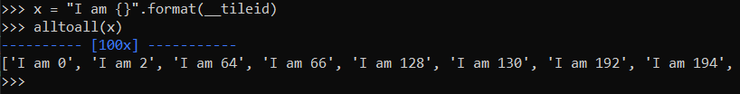
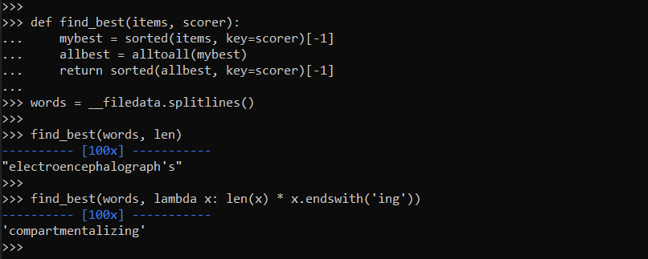

<p align="center">
  
</p>

# What

IPUpy is a poorly executed but totally serious implementation of a joke idea, porting a full python interpreter (including the parser and byte-code compiler) to run entirely in the SRAM (the on-chip "cache") of a single core inside the Colossus IPU. The IPU (Mk2) has 1,472 such cores per chip, allowing for *highly* parallelised (not just concurrent) multiprocessing in familiar python.

\**This is a silly experiment, not a product developed or supported by Graphcore. Using it in anger is a very bad idea.*\*

# How

The Poplar SDK provided by Graphcore includes a robust general-purpose C++ compiler called `popc` that can target the IPU. Even though it is intended for specialised AI compute programs, it happily gobbled up the ~60,000 lines of embedded [MicroPython](https://micropython.org/) source code I cloned off GitHub one weekend and spat out an on-chip python interpreter.

# Why

This project demonstrates the truly MIMD (Multiple Instruction Multiple Data) nature of the IPU, in contrast to other AI accelerators such as GPUs and TPUs that vectorise operations to achieve throughput and therefore struggle with dynamic and divergent program flows. Since the interpreter and python 'heap' fit entirely in the 608Kb of SRAM allocated to each IPU core, it also maintains maximum throughput despite uncoalesced memory accesses and indirection. In short, this project does nothing to dispel the notion that an IPU is just 1,472 small CPUs glued together on a crazy fast exchange fabric, able to run just fine completely independently as well in the cycle-perfect unison that is normally exploited for AI workloads.

# Examples

`libIPUpy` exports an API to launch and use a python interpreter on the tile, after that it's up to us to decide how we want to use it.

### A Multi-REPL

The `examples/` directory contains a toy program that launches 1472 interactive python REPLs (one on every IPU core) which you can play with on the command-line. Each character typed is sent to every interpreter, and their responses are deduplicated and printed to the terminal with multiplicity. This is the easiest way to parallelise your interactive python sessions!

From the project root, build `libIPUpy` and the examples with:

```bash
make -C libIPUpy
make -C examples
```

From the examples directory, run multirepl:



Each interpreter is given a unique python int called `__tileid`. Additionally, if you pass a file name as a cmdline argument to `multirepl`, the file will be read and divided up equally between tiles, accessible in each interpreter as a string variable `__tiledata`. This allows interactive parallel processing of the a file's contents, e.g., the linux built-in dictionary of words:



### More Chips

If you happen to have access to more IPUs in a single machine, you can increase `NUMIPUS` in `multirepl_params.h` and it will parallelise across as many chips as you want. Below is a screenshot of **47 thousand** python interpreters muxed together into a single repl, one on every tile across 32 IPUs :D. This has high compile time, but zero noticeable latency at run time.



### Communicating Between Interpreters

Changing the following parameters in `mutlirepl_params.h` (and cleaning and recompiling the examples directory) will set up the multirepl with a simple all-to-all data exchange primitive.

```c
#define COMMS        (true)
#define NUMTILES     (100)
#define COMMSBUFSIZE (64)
```

Now, the python function `alltoall` takes any python object as an input (as long as it can be `repr`'d into 64 bytes :D) , serialises it and broadcasts to all other interpreters. It returns a list of all the received objects.



We can use this primitive to define an easy parallel algorithm.



Be warned! This example is beginning to stretch this hacky POC codebase, which is why I've turned  the number of tiles down to 100. You might notice you can only execute `alltoall` a finite number of times before some horrible memory corruption bug locks up the application and eventually kills it. Oh well.

# Other examples

The multirepl is just one thing we can do with an on-tile python interpreter. `old_examples` contains a dump of material that I haven't cleaned up, were I:

- *[Example2 / IPUpyc]* Create a compilation preprocessor that allows you to write **inline python** in the middle of your C++ compute vertices on the IPU (the python source code is embedded as a string in the executable and interpreted on-chip at runtime).
- *[Example3]* The inline python region is convenient for doing lots of string processing that is annoying in C++, so example 3 uses it to compile it's own source-code preprocessing script (`IPUpyc`) into an IPU program, becoming partially **self-hosting**.
- *[Example 4]* Just a one-tile repl, but with a **virtual filesystem** ported to IPU and plugged into an SRAM-backed Block Device (a "RAM disk") allowing the python interpreter to read and write to an on-chip file-system (which can be backed up to host disk).
- *[Example 5]* Hacks together make-shift coroutines to allow the python interpreter to pause and resume computation between compute vertices, and **trigger syncs / data exchanges** (this is how `alltoall` works in the multirepl).
- *[Example 6]* Combines example 5 and example 4 to give an interpreter a **filesystem backed by SRAM on _other_ tiles**.
- *[Example 7]* Combining all the previous examples to make an **on-chip shell** using python.
